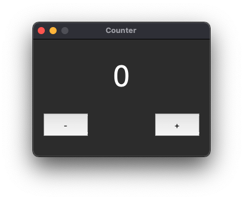

# Elementary Python counter

Simplest python app build with basics and tkinter and was published as the sample project because of I'm learning GIT.

There is a two buttons with symbols plus and minus to add and subtract 1 point to the number at middle of the app screen. If you want to reset just click on number.

I actually was looking for an app like this when I was sales manager to canculate the number of my calls.

